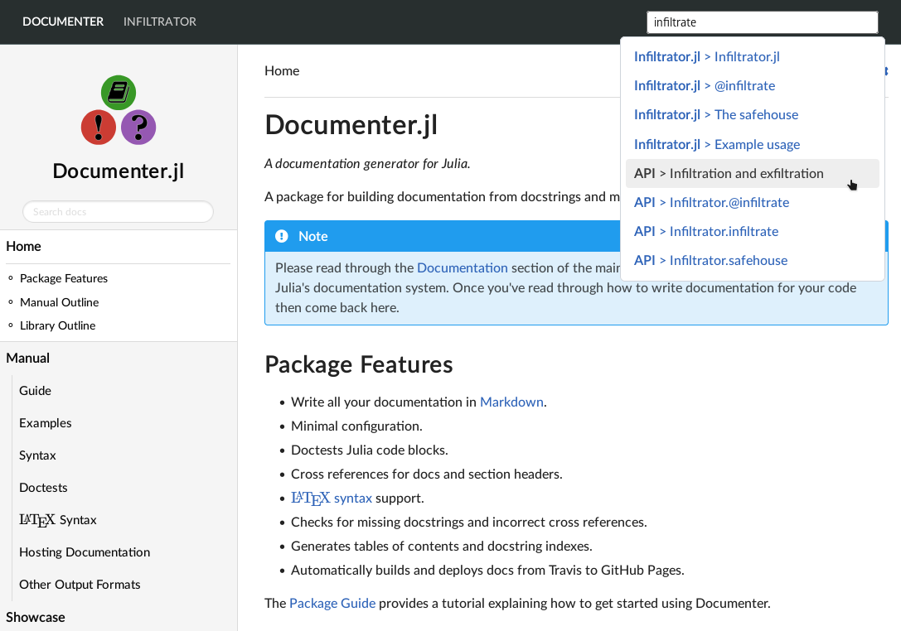

# MultiDocumenter

Example usage:
```julia
using MultiDocumenter

docs = [
    MultiDocumenter.MultiDocRef(
        upstream = "/home/pfitzseb/.julia/dev/Documenter/docs/build",
        path = "documenter",
        name = "Home"
    ),
    MultiDocumenter.MultiDocRef(
        upstream = "/home/pfitzseb/.julia/dev/Infiltrator/docs/build",
        path = "infil",
        name = "Infiltrator"
    )
]

MultiDocumenter.make(
    joinpath(@__DIR__, "out"),
    docs;
    assets_dir = joinpath(@__DIR__, "assets"),
    brand_image = MultiDocumenter.BrandImage(
        "documenter/index.html",
        "assets/brandimg.svg"
    ),
    custom_stylesheets = [
        "assets/custom.css",
        "assets/fonts/fonts.css",
    ]
)
```


