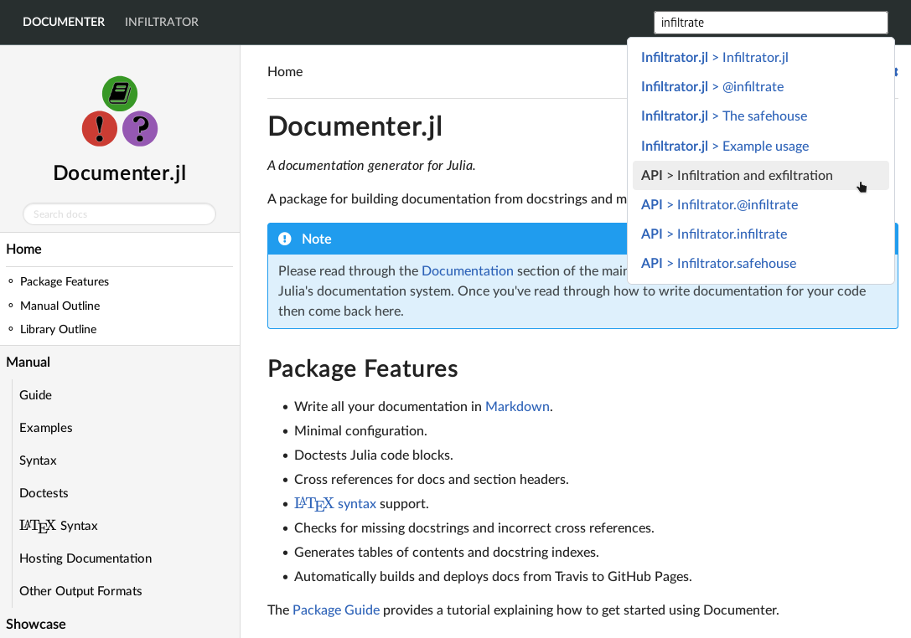

# MultiDocumenter

This package aggregates [Documenter.jl](https://github.com/JuliaDocs/Documenter.jl) documentation from multiple sources into one page with a global search bar.

## Example usage
```julia
using MultiDocumenter

clonedir = mktempdir()

docs = [
    MultiDocumenter.DropdownNav("Debugging", [
        MultiDocumenter.MultiDocRef(
            upstream = joinpath(clonedir, "Infiltrator"),
            path = "inf",
            name = "Infiltrator",
            giturl = "https://github.com/JuliaDebug/Infiltrator.jl.git",
        ),
        MultiDocumenter.MultiDocRef(
            upstream = joinpath(clonedir, "JuliaInterpreter"),
            path = "debug",
            name = "JuliaInterpreter",
            giturl = "https://github.com/JuliaDebug/JuliaInterpreter.jl.git",
        ),
    ]),
    MultiDocumenter.MegaDropdownNav("Mega Debugger", [
        MultiDocumenter.Column("Column 1", [
            MultiDocumenter.MultiDocRef(
                upstream = joinpath(clonedir, "Infiltrator"),
                path = "inf",
                name = "Infiltrator",
                giturl = "https://github.com/JuliaDebug/Infiltrator.jl.git",
            ),
            MultiDocumenter.MultiDocRef(
                upstream = joinpath(clonedir, "JuliaInterpreter"),
                path = "debug",
                name = "JuliaInterpreter",
                giturl = "https://github.com/JuliaDebug/JuliaInterpreter.jl.git",
            ),
        ]),
        MultiDocumenter.Column("Column 2", [
            MultiDocumenter.MultiDocRef(
                upstream = joinpath(clonedir, "Infiltrator"),
                path = "inf",
                name = "Infiltrator",
                giturl = "https://github.com/JuliaDebug/Infiltrator.jl.git",
            ),
            MultiDocumenter.MultiDocRef(
                upstream = joinpath(clonedir, "JuliaInterpreter"),
                path = "debug",
                name = "JuliaInterpreter",
                giturl = "https://github.com/JuliaDebug/JuliaInterpreter.jl.git",
            ),
        ]),
    ]),
    MultiDocumenter.MultiDocRef(
        upstream = joinpath(clonedir, "DataSets"),
        path = "data",
        name = "DataSets",
        giturl = "https://github.com/JuliaComputing/DataSets.jl.git",
        # or use ssh instead for private repos:
        # giturl = "git@github.com:JuliaComputing/DataSets.jl.git",
    ),
]

outpath = joinpath(@__DIR__, "out")

MultiDocumenter.make(
    outpath,
    docs;
    search_engine = MultiDocumenter.SearchConfig(
        index_versions = ["stable"],
        engine = MultiDocumenter.FlexSearch
    )
)
```

### Limiting copied versions and linking to all upstream versions

When aggregating many packages, you can copy only selected deployed versions to reduce storage size of the final website:

```julia
MultiDocumenter.MultiDocRef(
    upstream = joinpath(clonedir, "SomePackage"),
    path = "SomePackage",
    name = "SomePackage.jl",
    giturl = "https://github.com/SomeOrg/SomePackage.jl.git",
    include_versions = ["stable", "dev"],
    # optional: defaults to URL derived from giturl
    all_versions_url = "https://someorg.github.io/SomePackage.jl/",
)
```

- `include_versions` copies only those version directories (plus root files like `index.html` and `versions.js`).
- `versions.js` is rewritten to include only copied versions.
- The version selector gets a `See All Versions` option that opens `all_versions_url` in a new tab.
- If `all_versions_url` is omitted, MultiDocumenter derives it from `giturl` for GitHub repositories.



## Deployment

Check [`.github/workflows/deploy.yml`](.github/workflows/deploy.yml) and [`docs/make.jl`](docs/make.jl) for an example on how to deploy MultiDocumenter-generated aggregates to a git branch.

The result of that script is available at [https://juliacomputing.github.io/MultiDocumenter.jl/](https://juliacomputing.github.io/MultiDocumenter.jl/).

You can of course also just push the output artefact directly to S3 or some other hosting service.

> **Warning**
> MultiDocumenter sites can not be deployed on Windows right now, and the `make()` function will throw an error.
> See [#70](https://github.com/JuliaComputing/MultiDocumenter.jl/issues/70).
>
> It is still possible to develop and debug MultiDocumenter sites on Windows if the build script is run interactively (e.g. by `include`-ing it into a REPL session).
