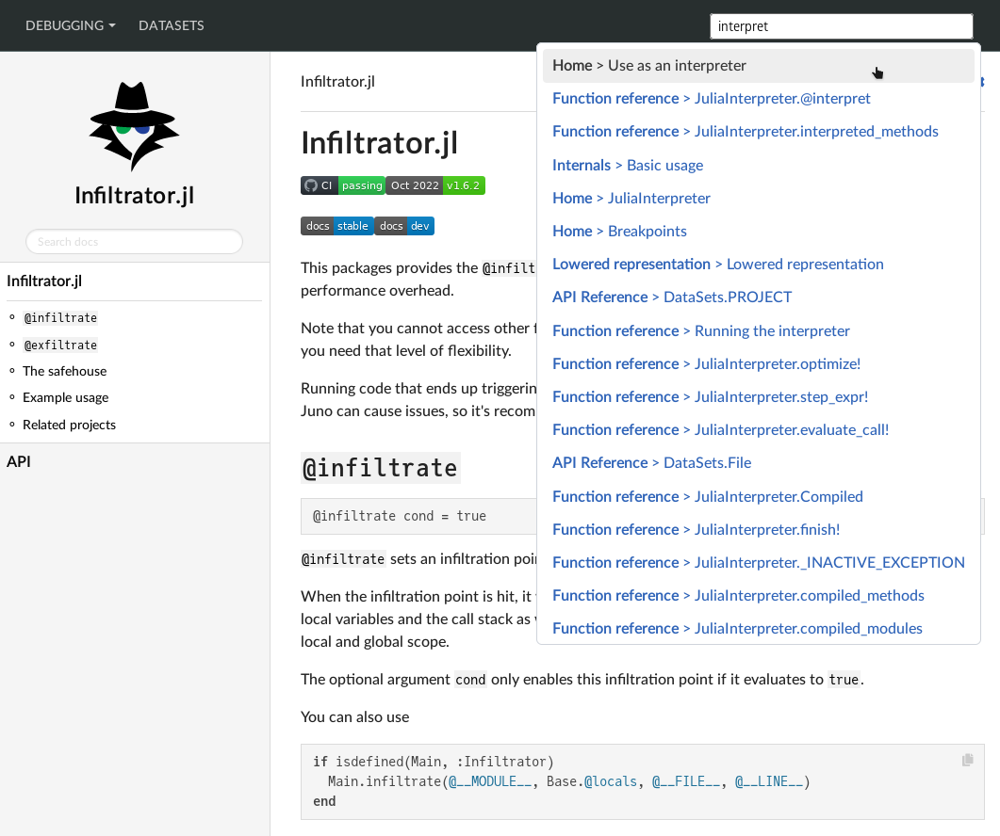

# MultiDocumenter

This package aggregates [Documenter.jl](https://github.com/JuliaDocs/Documenter.jl) documentation from multiple sources into one page with a global search bar.

## Example usage
```julia
using MultiDocumenter

clonedir = mktempdir()

docs = [
    MultiDocumenter.DropdownNav("Debugging", [
        MultiDocumenter.MultiDocRef(
            upstream = joinpath(clonedir, "Infiltrator"),
            path = "inf",
            name = "Infiltrator",
            giturl = "https://github.com/JuliaDebug/Infiltrator.jl.git",
        ),
        MultiDocumenter.MultiDocRef(
            upstream = joinpath(clonedir, "JuliaInterpreter"),
            path = "debug",
            name = "JuliaInterpreter",
            giturl = "https://github.com/JuliaDebug/JuliaInterpreter.jl.git",
        ),
    ]),
    MultiDocumenter.MultiDocRef(
        upstream = joinpath(clonedir, "DataSets"),
        path = "data",
        name = "DataSets",
        giturl = "https://github.com/JuliaComputing/DataSets.jl.git",
        # or use ssh instead for private repos:
        # giturl = "git@github.com:JuliaComputing/DataSets.jl.git",
    ),
]

outpath = joinpath(@__DIR__, "out")

MultiDocumenter.make(
    outpath,
    docs;
    search_engine = MultiDocumenter.SearchConfig(
        index_versions = ["stable"],
        engine = MultiDocumenter.FlexSearch
    )
)
```


